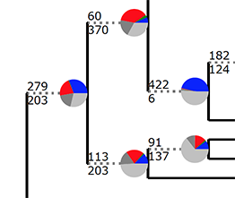
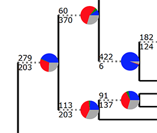

# Target enrichment orthology

#### This repository contains scripts for orthology in inference from target enrichment data (e.g. Hyb-Seq) and relies mainly in scripts from [Phylogenomic dataset construction respository](https://bitbucket.org/yanglab/phylogenomic_dataset_construction/src/master/) plus some new ones.

#### If using the scrips from this repository you must cite

Morales-Briones, D.F., B. Gehrke, H. Chien-Hsun Huang, A. Liston, M. Hong. H.E. Marx, D.C. Tank & Y. Yang. Analysis of paralogs in target enrichment data pinpoints multiple ancient polyploidy events in Alchemilla s.l. (Rosaceae). [bioRxiv 2020.08.21.261925; doi: https://doi.org/10.1101/2020.08.21.261925 ](https://doi.org/10.1101/2020.08.21.261925)

Yang, Y. and S.A. Smith. 2014. Orthology inference in non-model organisms using transcriptomes and low-coverage genomes: improving accuracy and matrix occupancy for phylogenomics. Molecular Biology and Evolution. [doi:10.1093/molbev/msu245](https://doi.org/10.1093/molbev/msu245)

### Dependencies needed to run the scripts. 

[TreeShrink](https://github.com/uym2/TreeShrink) It works now with Version 1.3.2 (older versions won't work)

[RAxML](https://github.com/stamatak/standard-RAxML) Version 8.2.11  (newer versions should work)

[Phyx](https://github.com/FePhyFoFum/phyx)

[MAFFT](https://mafft.cbrc.jp/alignment/software/) Version 7.307 (newer versions should work)

[MACSE](https://bioweb.supagro.inra.fr/macse/index.php?menu=releases) Version 2.0.3 (newer versions should work)

## Step 1: Format paralog fasta files

#### **This example is for the output of 'paralog_investigator' of [HybPiper](https://github.com/mossmatters/HybPiper/wiki/Paralogs)**

To use the script from [Phylogenomic dataset construction respository](https://bitbucket.org/yanglab/phylogenomic_dataset_construction/src/master/) an "@" symbol needs to be added in the fasta headers to identify paralogs of the same sample.

The fasta files *.paralogs.fasta after running 'paralog_investigator' have a format from [SPAdes](http://cab.spbu.ru/software/spades/) like

\>Rosa_woodsii  
AGTC...  
\>Lachemilla_pinnata.0 NODE_2_length_1787_cov_230.693567,Fragaria-gene15996_1557_01,4,519,78.47,(+),1,1537  
ACGT.....  
\>Alchemilla_colura.main NODE_3_length_1706_cov_62.896426,Fragaria-gene15996_1557_01,0,517,81.43,(-),1552,1  
ACCC....  
\>Alchemilla_colura.1 NODE_1_length_2101_cov_47.514174,Fragaria-gene15996_1557_01,0,519,79.11,(+),136,1687  
ACCG....  

##### To format the sequences run the next loop in the directory where fasta files are locaded: (Note: This command will overwrite the fasta files)

	for i in $(ls *.fasta); do
	sed -i -E 's/(>.+)\.(.+)\s(.+)/\1@paralog_\2/‘ $i
	sed -i '/>/ {/@/! s/$/@unique/}’ $i
	done 
	
The output of this will be

\>Rosa_woodsii@unique  
AGTC...  
\>Lachemilla_pinnata@paralog_0  
ACGT.....  
\>Alchemilla_colura@paralog_main  
ACCC....  
\>Alchemilla_colura@paralog_1  
ACCG....  

##### For details of SPAdes contigs see [HybPiper's paralogs description](https://github.com/mossmatters/HybPiper/wiki/Paralogs)

If other additional sequences are added to the fasta files (e.g. from reference genomes) make sure that those also have the "@" format.

I added reference sequences of *Fragaria vesca* as Fragaria_vesca@genome

## Step 2: Build homolog trees

I used Macse for DNA alignment. Macse does not have multithread running options, so I wrote individual bash files to run them in parallel.

##### To write bash files

	for filename in $(ls *.fasta)
	do
	echo java -jar ~/Apps/macse_v2.03.jar -prog alignSequences -seq $filename -out_NT $(cut -d'.' -f1 <<<"$filename").NT.aln -out_AA $(cut -d'.' -f1 <<<"$filename").AA.aln > $(cut -d'.' -f1 <<<"$filename").sh
	done  

##### To run alignment runs in parallel

	parallel -j 32 bash ::: *.sh

If there are frame shifts in the alignments, Macse will replace the shifted codons with "!" and will cause problems with RAxML or IQtree. 

##### To replace "!" codon with gaps

	python remove_shifted_codons_from_macse.py <alignment directory> <fasta file extension> <output directory> <nt or aa>
		
	
##### Alternatively, Mafft can be used for the alignment

 	python mafft_wrapper.py <fasta files directory> <fasta file extension> <# of threads> <dna or aa>
 	
 	
##### Trim alignments with Phyx

	python pxclsq_wrapper.py <alignment directory > <mininum column occupancy> <dna or aa>
	
The output will files with extension .aln-cln

##### Infer ML trees with RAxML. This will infer trees with GTRGAMMA and 100 bootstrap replicates (different model and # of bs replicates can be modify in the script).  

	python raxml_bs_wrapper.py <aln-cln files directory> <# of threads> <dna or aa>
	
	
##### If no bs replicates are needed use. 
	
	python raxml_wrapper.py <aln-cln files directory> <# of threads> <dna or aa>
	
	
##### Mask both mono- and (optional) paraphyletic tips that belong to the same taxon. Keep the tip that has the most un-ambiguous charactors in the trimmed alignment.

	python mask_tips_by_taxonID_transcripts.py <tre files directory> <aln-cln files directory> mask_paraphyletic <y or n>
	

##### Alternatively, to remove only monophyletic tips and keep the sequence with the shortest terminal branch length.

	python mask_tips_by_taxonID_genomes.py <tre files directory>
	

##### Trim spurious tips with [TreeShrink](https://github.com/uym2/TreeShrink)

	python tree_shrink_wrapper.py <input directory> <tree file extension> <quantile>

It outputs the tips that were trimmed in the file .txt and the trimmed trees in the files .tt. You would need to test different quantiles to see which one fit better your data. 

##### These are you final homologs trees. If you want to repeat the tree inference, masking, and trimming or just re-infer homologs trees without removed tips. Write fasta files from trimmed trees. 

	python write_homolog_fasta_from_multiple_aln.py <original "@" formated fasta files directory> <trimmed trees directory> <fasta file extension> <tree file extension> <output directory>

## Step 3: Paralogy pruning to infer orthologs. Use one of the following

#### For details of orthology inference refer to Yang and Smith (2014) [doi:10.1093/molbev/msu245](https://doi.org/10.1093/molbev/msu245)

##### 1to1: only look at homologs that are strictly one-to-one. No cutting is carried out.
	
	python filter_1to1_orthologs.py <final homologs directory> <tree file extension> <minimal number of taxa> <output directory>

##### MI: prune by maximum inclusion.  Set OUTPUT_1to1_ORTHOLOGS to False if wish only to ouput orthologs that is not 1-to-1, for example, when 1-to-1 orthologs have already been analyzed in previous steps.

	python prune_paralogs_MI.py <final homologs directory> <tree file extension> <relative long tip cutoff> <absolute long tip cutoff> <minimal number of taxa> <output directory>

##### MO: prune by using homologs with monophyletic, non-repeating outgroups, reroot and cut paralog from root to tip. If no outgroup, only use those that do not have duplicated taxa. Change the list of ingroup and outgroup names first. Set OUTPUT_1to1_ORTHOLOGS to False if wish only to ouput orthologs that is not 1-to-1

	python prune_paralogs_MO.py <final homologs directory> <tree file extension> <minimal number of taxa> <output directory>

##### RT: prune by extracting ingroup clades and then cut paralogs from root to tip. If no outgroup, only use those that do not have duplicated taxa. Compile a list of ingroup and outgroup taxonID, with each line begin with either "IN" or "OUT", followed by a tab, and then the taxonID.

	python prune_paralogs_RT.py <final homologs directory> <tree file extension> <output directory>  <minimal number of taxa> <ingroup and outgroup taxonIDs table>

##### Or alternatively, if the input homolog tree is already rooted

	python prune_paralogs_from_rooted_trees.py <final homologs directory> <tree file extension> <minimal number of taxa> <output directory>

## Step 4: Visualize matrix occupancy stats, write final fasta files and build supermatrix (optional)

	python ortholog_occupancy_stats.py <orthologs directory>

##### Read in and rank number of taxa per ortholog from highest to lowest. Plot in R the ranked number of taxa per ortholog

	a <- as.numeric(read.table("ortho_stats")[1])
	a <- sort(a, decreasing=TRUE)
	pdf(file="taxon_occupancy.pdf")
	plot(a, type="l", lwd=3, ylab="Number of Taxa in Each Ortholog")
	dev.off()

##### Check taxon_stats to see if any taxa have unusally low number of genes in the orthologs and decide the minimum number of taxa for the supermatrix. 

##### Write new and final fasta files from ortholog trees

	python write_ortholog_fasta_from_multiple_aln.py <original "@" formated fasta files directory> <orthologs directory> <fasta file extension> <orthologs tree file extension> <output directory>
	
##### With those you can align, clean, infer trees from final orthologs, and infer species trees using your preferred tools

 
##### If a supermatrix of clean alignment is needed. Once you have clean alignments, choose the minimal cleaned alignment length and minimal number of taxa of each ortholog to include in the supermatrix

	python concatenate_matrices_phyx.py <aln-cln files directory> <minimum number of sites> <minimum number of taxa> <output directory>

This will output a list of cleaned orthology alignments that passed the filter, a summary of taxon matrix occupancies to check whether any taxon is under represented, and a concatenated matrix in fasta, phylip, and nexus format as well as a partition file for RAxML or IQtree.

## Plotting PhyParts pie charts

[PhyParts](https://bitbucket.org/blackrim/phyparts/src/master/) is a great tool to explore gene tree conflict and Matt Johnson has a great pie chart visualization script [here](https://github.com/mossmatters/MJPythonNotebooks/blob/master/PhyParts_PieCharts.ipynb)

Still, this visualization assumes a fix number informing gene trees for all nodes. In other words, assumes no missing taxa in the ortholog gene trees. While this can be the case of genomic or transcriptomic filtered datasets of MO orthologs. This is not necessary the case of RT othologs, or when there is missing taxa in the gene trees like the case of target enrichment datasets or patchy transcriptomic/genomic datasets. The assumption of equal number of informing gene trees also does not apply with running PhyParts with homologs trees, where duplications and missing taxa will be mostly present.

If we use a fix number of genes for orthologs with missing taxa, the 'grey' part of the pie charts will be the sum of missing and uninformative nodes. If there is a lot of missing data, this can be misleading and give the false impression of a lot of uninformative nodes (below the support treshold used when running PhyParts). In the case of homologs, the proportion all pie charts will be incorrect on top of the same problem with the missing and uninformative nodes.

To fix this we can plot the pie charts proportional to the number of informing nodes. If you ran a full concordance analyses (-a 1) with support cutoff option (-s), PhyParts only report total of concordant and discordant numbers that passed the support threshold, but it is missing the number of nodes that did not pass. To get this number we can run an addional quick concordant analyses (-a 0) without the support cutoff option (-s) and combine the information of both analyses.

We can combine the information of both analyses to get files to plot proportional pie charts in R:

	library(phytools)

	read.tree("A_0_No_BS_RT_all_homologs.concon.tre")->No_bs #Tree file output from phyparts of concordance (-a 0) anlysis with out support filtering (-s)
	read.tree("A_1_BS_50_RT_all_homologs.concon.tre")->bs_full_concordance #Tree file output from phyparts of full concordance anlysis (-a 1) with support filtering (e.g. Bootstrap 50; -s 50)
	
	total_no_bs<-No_bs[[1]] # get a tree to add total node numbers
	
	total_no_bs$node.label<-mapply("+",as.numeric(No_bs[[1]]$node.label), as.numeric(No_bs[[2]]$node.label)) #get total number of nodes
	total_no_bs$node.label[is.na(total_no_bs$node.label)] <- "" #remove NA values
	total_no_bs$node.label[total_no_bs$node.label=="0"]<-"" #remove 0 values. to avoid divisions by zero.
	
	
	append(bs_full_concordance, total_MO_no_bs, after=2)-> full_concordance_and_total_nodes #append tree with total number of nodes to tree file output from phyparts of full concordance anlysis
	
	write.tree(full_concordance_and_total_nodes, file = "A_1_BS_50_RT_all_homologs.concon.tre") #write tree. this will replace to orignal file.

Then we can used the the following script to plot pie charts that each is proportional to the total number of informing genes.

	python phypartspiecharts_proportional.py <species_tree> <phyparts_prepend_output_files>
	
The 'species_tree' is the map tree that you used for phyparts and 'phyparts_prepend_output_files' is the prefix of PhyParts outpuf files of the full concordance analyses (-a 1) with the modified *.concon.tre file from R.

When plotting pie charts of analyses that used homologs, you should always use 'proportional' script.  

Other option for ortholog gene trees is to plot the missing and uninformative separately as it own slice of the pie chart. To do this you can use the following script.

 	python phypartspiecharts_missing_uninformative.py <species_tree> <phyparts_prepend_output_files> <number of genes>
 	
Those pie charts will look similar if using the original script, but the 'grey' part is now divided into uninformative and missing. The 'number of genes' is the number of input gene trees for the PhyParts analysis.  

#### Pie charts examples

Pie charts made with the [original script](https://github.com/mossmatters/MJPythonNotebooks/blob/master/phypartspiecharts.py) using a fix number of gene trees look like this. Because we have have missing taxa in the gene trees the grey slice represent the uninformative and missing together. This gives the impression of a lot uninformative genes trees for those nodes.  

   

Pie charts made with 'phypartspiecharts_missing_uninformative.py.' In this case the uninformative are 'dark grey' and missing 'light grey'. The total number of gene trees is the same as in the original script.  

 

  
Pie charts made with the 'phypartspiecharts_proportional.py.' In this case each pie charts is proportional to total number of informing gene for that node and do not take in account the missing ones. The grey part represent only the uninformative gene trees. Always use this option when plotting Phyparts analyses of homolog gene trees.

